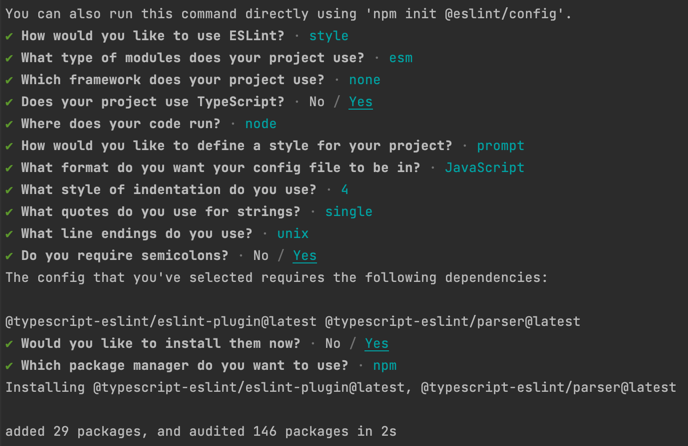
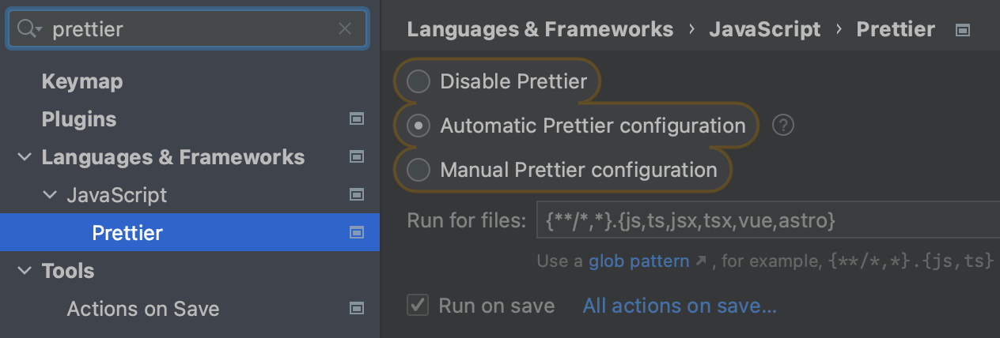
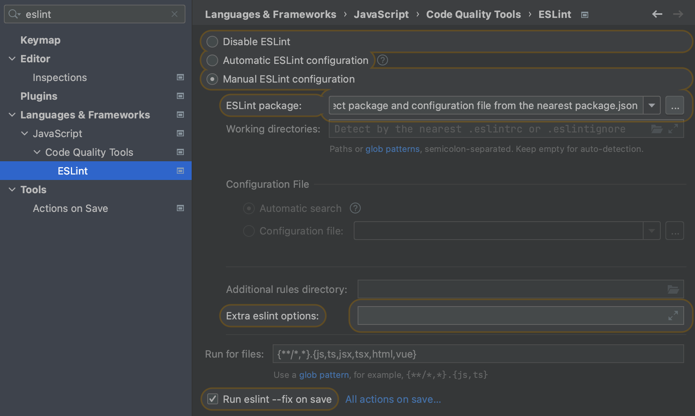
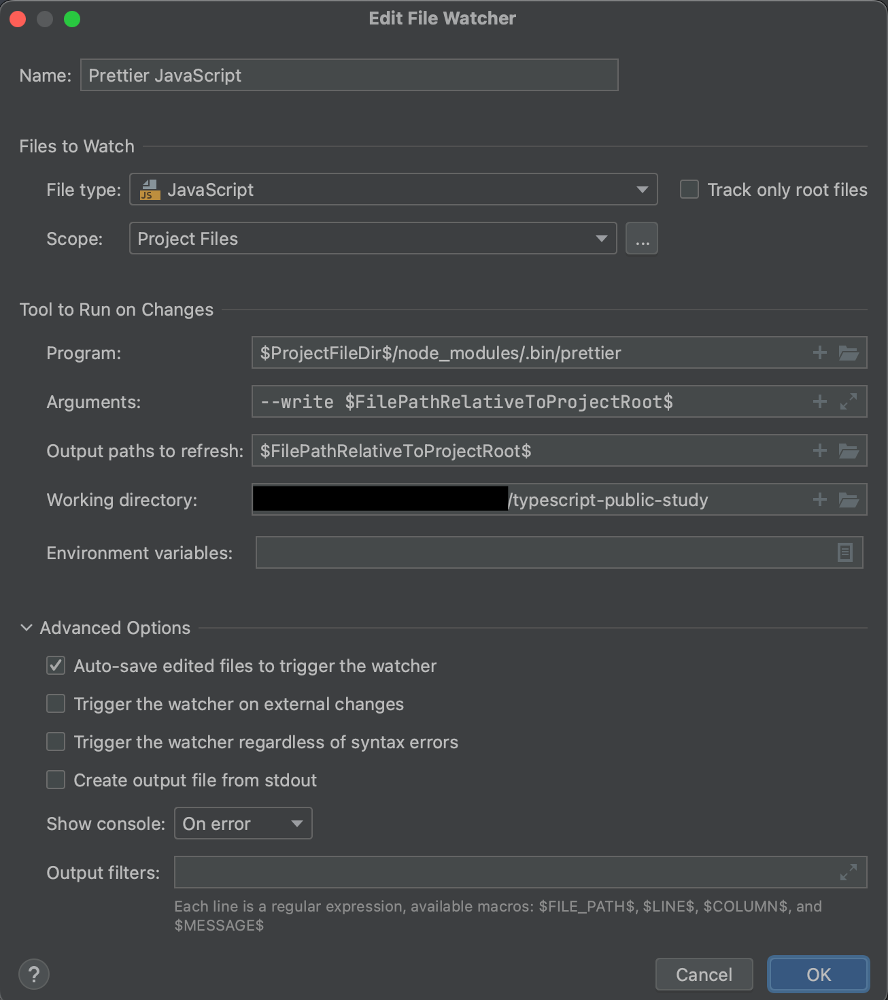
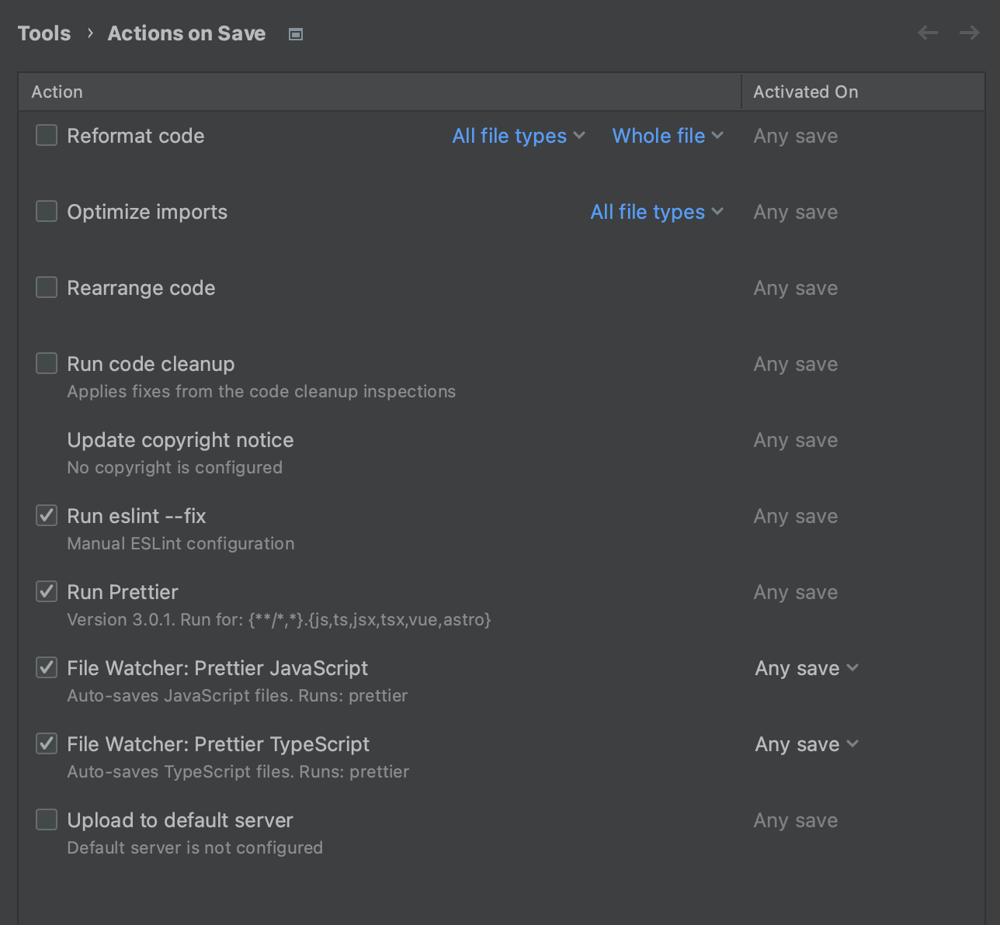

타입스크립트 공식문서 위주로 공부한 내용 기록

초기 설정

$ `npm init`

eslint & prettier

$ `npm i eslint prettier eslint-config-prettier`

$ `npx eslint --init`

WebStorm 설정

Tools - File Watcher - 추가

사용하는 파일 확장자에 대해서 같은형식으로 추가 (ts, tsx 등)

확인

참조 링크
WebStorm 설정: https://velog.io/@seungchan__y/Webstorm%EC%97%90%EC%84%9C-ESLint-Prettier-%EC%A0%81%EC%9A%A9%ED%95%98%EA%B8%B0